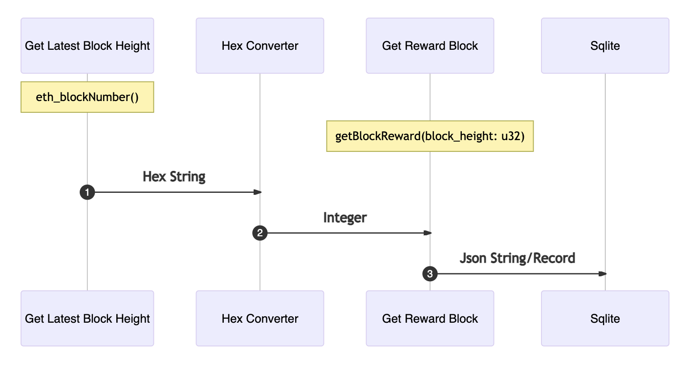

# Blocks To Database

It's been a long time coming but finally, we are ready to save data in SQLIte by simply coordinating the various services we already deployed into one big-ass AIR script:

```text
; ethqlite_rountrip.clj
(xor
    (seq
        (seq
            (seq
                (seq
                    (seq
                        (seq
                            (seq
                                (call relay ("op" "identity") [])
                                (call node_1 (service_1 "get_latest_block") [api_key] hex_block_result)
                            )
                            (seq
                                (call relay ("op" "identity") [])
                                (call %init_peer_id% (returnService "run") [hex_block_result])
                            )
                        )
                        (seq
                            (seq
                                (call relay ("op" "identity") [])
                                (call node_2 (service_2 "hex_to_int") [hex_block_result] int_block_result)
                            )
                            (seq
                                (call relay ("op" "identity") [])
                                (call %init_peer_id% (returnService "run") [int_block_result])
                            )
                        )
                    )
                    (seq
                        (seq
                            (call relay ("op" "identity") [])
                            (call node_1 (service_1 "get_block") [api_key int_block_result] block_result)
                        )
                        (seq
                            (call relay ("op" "identity") [])
                            (call %init_peer_id% (returnService "run") [block_result])
                        )
                    )
                )
                (seq    
                    (seq
                        (call relay ("op" "identity") [])
                        (call sqlite_node (sqlite_service "update_reward_blocks") [block_result] insert_result)
                    )
                    (seq
                        (call relay ("op" "identity") [])
                        (call %init_peer_id% (returnService "run") [insert_result])
                    )
                )
            )
            (seq
                (seq
                    (call relay ("op" "identity") [])
                    (call sqlite_node (sqlite_service "get_latest_reward_block") [] select_result)
                )
                (seq
                    (call relay ("op" "identity") [])
                    (call %init_peer_id% (returnService "run") [select_result])
                )
            )
        )
        (seq
            (seq
                (seq
                    (call relay ("op" "identity") [])
                    (call sqlite_node (sqlite_service "get_reward_block") [int_block_result] select_result_2)
                )
                (seq
                    (call relay ("op" "identity") [])
                    (call %init_peer_id% (returnService "run") [select_result_2])
                )
            )
            (seq
                (seq
                    (call relay ("op" "identity") [])
                    (call sqlite_node (sqlite_service "get_miner_rewards") [select_result_2.$.["block_miner"]!] select_result_3)
                )
                (seq
                    (call relay ("op" "identity") [])
                    (call %init_peer_id% (returnService "run") [select_result_3])
                )
            )
        )
    )
    (seq
        (call relay ("op" "identity") [])
        (call %init_peer_id% (returnService "run") ["XOR FAILED" %last_error%])
    )  
)
```

The script extends our previous incarnation by adding only one more method: `update_reward_blocks`, and a few testing calls, i.e., query the table. We need to gather our node and service ids \(which are different for you!\) to update our json data argument for the `fldist` call:

```bash
-d '{"service_1":"ca0eceb3-871f-440e-aff1-0a186321437d", \
     "node_1":"12D3KooWQQYXh78acqBNuL5p1J5tmH4XCKLCHM21tMb8pcxqGL17", \
     "service_2":"36043704-4d40-4c74-a1bd-3abbde28305d", \
     "node_2": "12D3KooWQQYXh78acqBNuL5p1J5tmH4XCKLCHM21tMb8pcxqGL17", \
     "sqlite_service":"470fcaba-6834-4ccf-ac0c-4f6494e9e77b", \
     "sqlite_node":"12D3KooWQQYXh78acqBNuL5p1J5tmH4XCKLCHM21tMb8pcxqGL17", \
     "api_key": "MC5H2NK6ZIPMR32U7D4W35AWNNVCQX1ENH"}'
```

and run the AIR script with the revised `fldist` command:

```bash
fldist --node-id 12D3KooWQQYXh78acqBNuL5p1J5tmH4XCKLCHM21tMb8pcxqGL17 --node-addr /ip4/127.0.0.1/tcp/9999/ws/p2p/12D3KooWQQYXh78acqBNuL5p1J5tmH4XCKLCHM21tMb8pcxqGL17 run_air  -p air-scripts/ethqlite_roundtrip.clj -d '{"service_1":"ca0eceb3-871f-440e-aff1-0a186321437d", "node_1":"12D3KooWQQYXh78acqBNuL5p1J5tmH4XCKLCHM21tMb8pcxqGL17","service_2":"36043704-4d40-4c74-a1bd-3abbde28305d", "node_2": "12D3KooWQQYXh78acqBNuL5p1J5tmH4XCKLCHM21tMb8pcxqGL17", "sqlite_service":"470fcaba-6834-4ccf-ac0c-4f6494e9e77b", "sqlite_node":"12D3KooWQQYXh78acqBNuL5p1J5tmH4XCKLCHM21tMb8pcxqGL17", "api_key": "MC5H2NK6ZIPMR32U7D4W35AWNNVCQX1ENH"}' -s H9BSbZwKmFs93462xbAyfEdGdMXb5LZuXL7GSA4uPK4V
client seed: H9BSbZwKmFs93462xbAyfEdGdMXb5LZuXL7GSA4uPK4V
client peerId: 12D3KooWKphxxaXofYzC2TsN79RHZVubjmutKVdPUxVMHY3ZsVww
relay peerId: 12D3KooWQQYXh78acqBNuL5p1J5tmH4XCKLCHM21tMb8pcxqGL17
Particle id: 5ce2dcf0-2d4d-40ec-8cef-d5a0cea4f0e7. Waiting for results... Press Ctrl+C to stop the script.
===================
[
  "0xb807a1"
]
[
  [
    {
      peer_pk: '12D3KooWQQYXh78acqBNuL5p1J5tmH4XCKLCHM21tMb8pcxqGL17',
      service_id: 'ca0eceb3-871f-440e-aff1-0a186321437d',
      function_name: 'get_latest_block',
      json_path: ''
    }
  ]
]
===================
===================
[
  12060577
]
[
  [
    {
      peer_pk: '12D3KooWQQYXh78acqBNuL5p1J5tmH4XCKLCHM21tMb8pcxqGL17',
      service_id: '36043704-4d40-4c74-a1bd-3abbde28305d',
      function_name: 'hex_to_int',
      json_path: ''
    }
  ]
]
===================
===================
[
  "{\"status\":\"1\",\"message\":\"OK\",\"result\":{\"blockNumber\":\"12060577\",\"timeStamp\":\"1616042932\",\"blockMiner\":\"0x2f731c3e8cd264371ffdb635d07c14a6303df52a\",\"blockReward\":\"3622523288217263710\",\"uncles\":[],\"uncleInclusionReward\":\"0\"}}"
]
[
  [
    {
      peer_pk: '12D3KooWQQYXh78acqBNuL5p1J5tmH4XCKLCHM21tMb8pcxqGL17',
      service_id: 'ca0eceb3-871f-440e-aff1-0a186321437d',
      function_name: 'get_block',
      json_path: ''
    }
  ]
]
===================
===================
[
  {
    "err_str": "",
    "success": 1
  }
]
[
  [
    {
      peer_pk: '12D3KooWQQYXh78acqBNuL5p1J5tmH4XCKLCHM21tMb8pcxqGL17',
      service_id: '470fcaba-6834-4ccf-ac0c-4f6494e9e77b',
      function_name: 'update_reward_blocks',
      json_path: ''
    }
  ]
]
===================
===================
[
  {
    "block_miner": "\"0x2f731c3e8cd264371ffdb635d07c14a6303df52a\"",
    "block_number": 12060577,
    "block_reward": "3622523288217263710",
    "timestamp": 1616042932
  }
]
[
  [
    {
      peer_pk: '12D3KooWQQYXh78acqBNuL5p1J5tmH4XCKLCHM21tMb8pcxqGL17',
      service_id: '470fcaba-6834-4ccf-ac0c-4f6494e9e77b',
      function_name: 'get_latest_reward_block',
      json_path: ''
    }
  ]
]
===================
===================
[
  {
    "block_miner": "\"0x2f731c3e8cd264371ffdb635d07c14a6303df52a\"",
    "block_number": 12060577,
    "block_reward": "3622523288217263710",
    "timestamp": 1616042932
  }
]
[
  [
    {
      peer_pk: '12D3KooWQQYXh78acqBNuL5p1J5tmH4XCKLCHM21tMb8pcxqGL17',
      service_id: '470fcaba-6834-4ccf-ac0c-4f6494e9e77b',
      function_name: 'get_reward_block',
      json_path: ''
    }
  ]
]
===================
===================
[
  {
    "miner_address": "\"0x2f731c3e8cd264371ffdb635d07c14a6303df52a\"",
    "rewards": [
      "3622523288217263710"
    ]
  }
]
[
  [
    {
      peer_pk: '12D3KooWQQYXh78acqBNuL5p1J5tmH4XCKLCHM21tMb8pcxqGL17',
      service_id: '470fcaba-6834-4ccf-ac0c-4f6494e9e77b',
      function_name: 'get_miner_rewards',
      json_path: ''
    }
  ]
]
===================
```

And that's a wrap!

In summary, we have developed and deployed multiple Fluence services to store Ethereum reward block data in a SQLite as a service database and used Aquamarine to coordinate those services into applications. See Figure 2 below.

Figure 2: Aquamarine Application Creation From Modules And Services



Working through this project hopefully made it quite clear that the combination of distributed network services and Aquamarine makes for the easy and expedient creation of powerful applications by composition and coordination. Moreover, it showcases the power of reusability and hints at the \(economic\) rent available to developers. Presumably not entirely unexpectedly, there is a bit more to discover, a little more power to be unleashed. In the next section we touch upon two additional concepts to extend our capabilities: How to incorporate peer-based script execution into our workflow and how to utilize advanced, in-flow \(or in-transit\) results processing.

