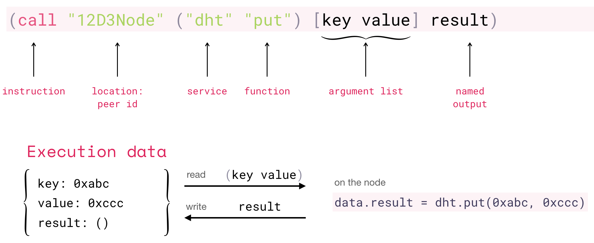
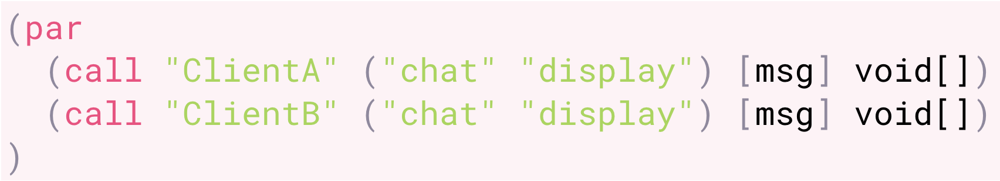
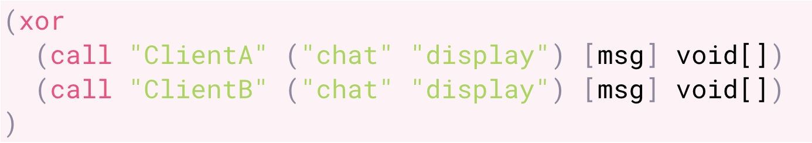

# AIR

The Aquamarine Intermediate Representation \(AIR\) is a low level language to program both distributed networks and the services deployed on them. The language is comprised of a small number of instructions:

* _**call**_: : execution
* _**seq**_ : sequential
* _**par**  :_ parallel
* _**fold**_ : iteration
* _**xor** :_ branching & error handling
* _**null**_ : empty instruction

which operate on _peer-id_ \(location\), _service-id_, and _service method_ over an argument list, see Figure 1.

**Figure 1: AIR Instruction Definition** 

## Instructions

AIR instructions are intended to launch the execution of a service method as follows:

1. The method is executed on the peer specified by the peer id \(location\) parameter
2. The peer is expected to have the Wasm service specified by the service id parameter
3. The service must have a callable method specified be the method parameter
4. The arguments specified by the argument list are passed to the method
5. The result of the method returned under the name output name

**Figure 2: Sequential Instruction** 

The _**seq**_ instruction takes two instructions at most as its arguments and executes them sequentially, one after the other.

**Figure 3: Parallel Instruction** 

The _**par**_ instruction takes two instructions at most as its arguments and particles may execute on parallel paths iff each service referenced is hosted on a different node otherwise particles execute sequentially

TODO: add better graphic showing the disticntion of branching vs seq.

**Figure 4: Fold Instruction** 

The _**fold**_ instruction iterates over the elements of an array and workds as follows:

* _**fold**_ instruction takes three arguments: an array, a variable and an instruction
* At each iteration, the variable is assigned an element of the array and the argument-instruction is executed
* The argument-instruction can access the variable and uses the next statement to trigger the next iteration

Figure 5: Branching Instruction 

This instruction is intended for organizing branches in the flow of execution as well as for handling errors:

* The _**XOR**_ instruction takes two instructions as its arguments
* The first instruction is executed and if the execution is successful, then the second instruction is ignored
* If the first instruction fails, then the second one is executed.

**Figure 6: Null Instruction** 

This is an empty instruction: it takes no arguments and does nothing. The _**null**_ instruction is useful for generating code.

